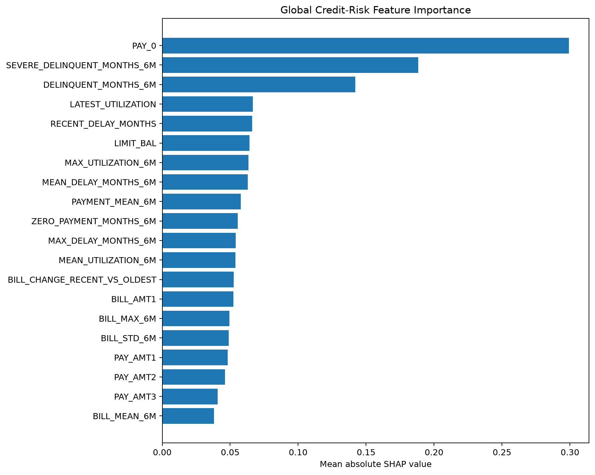
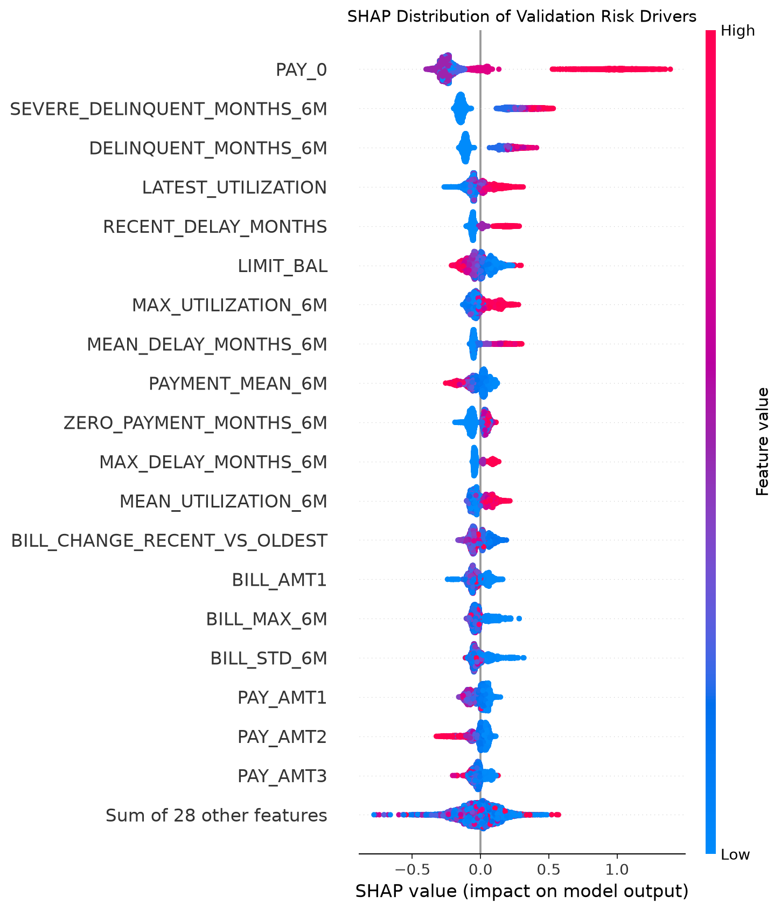
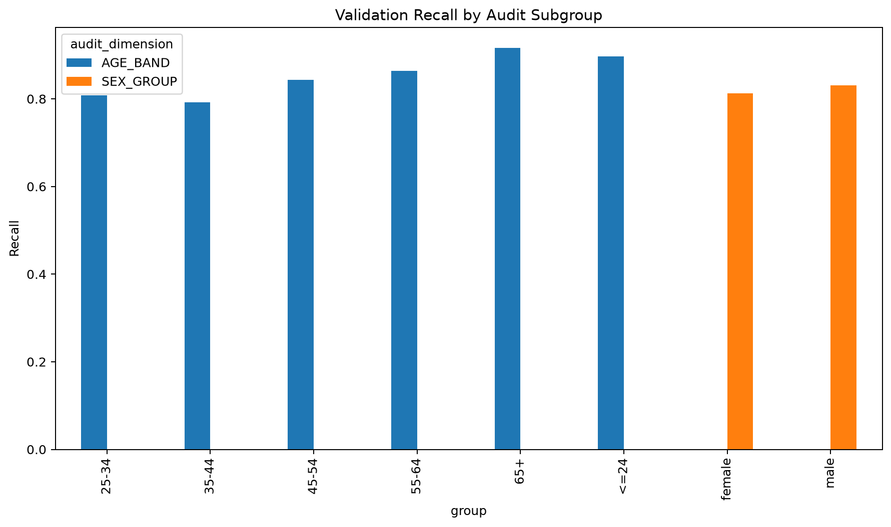
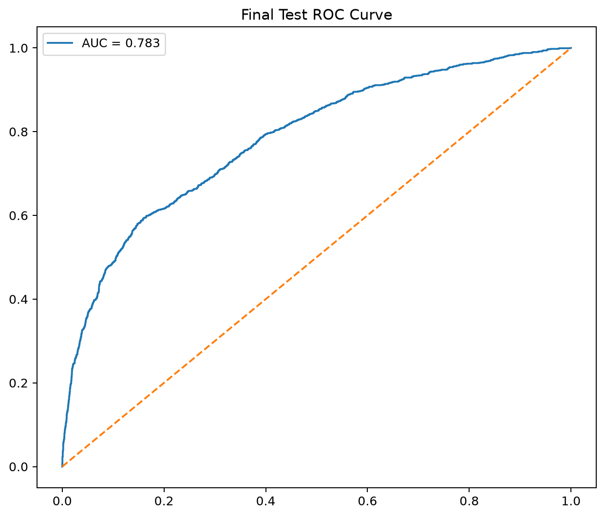
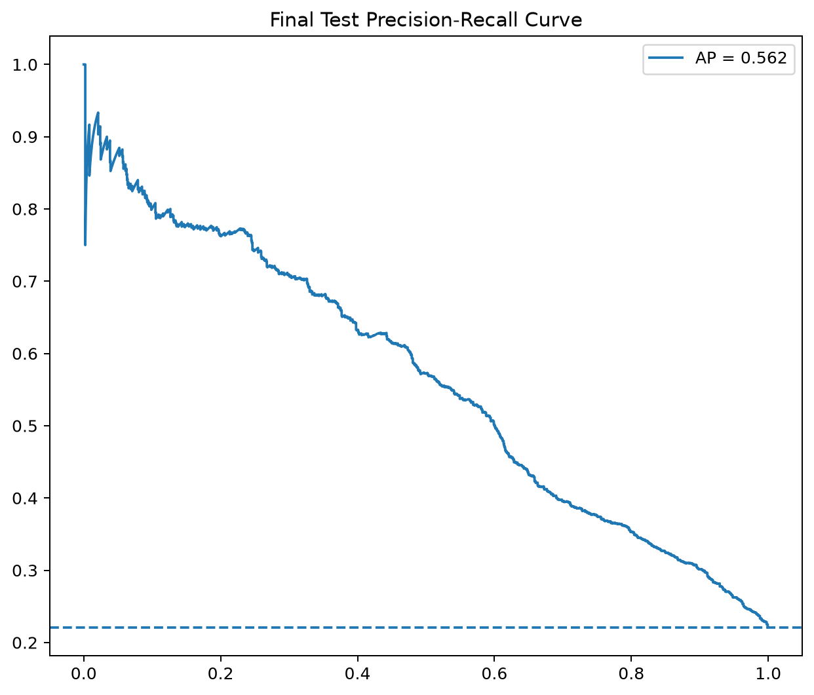
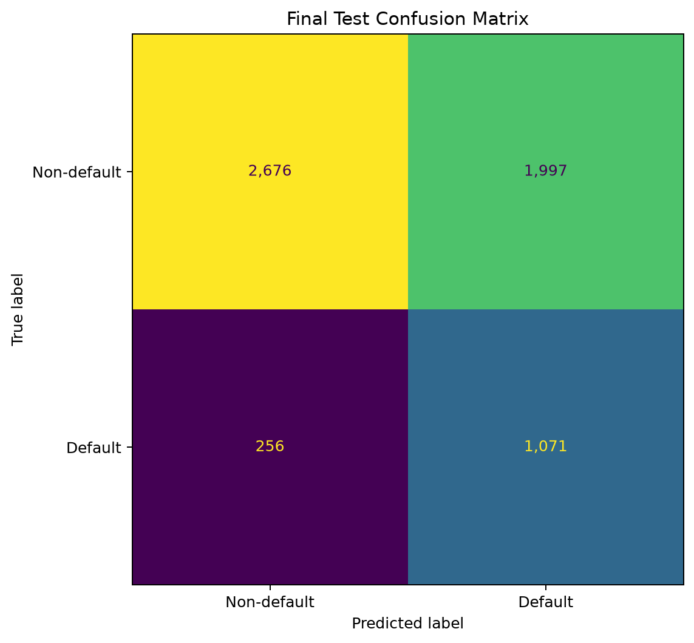
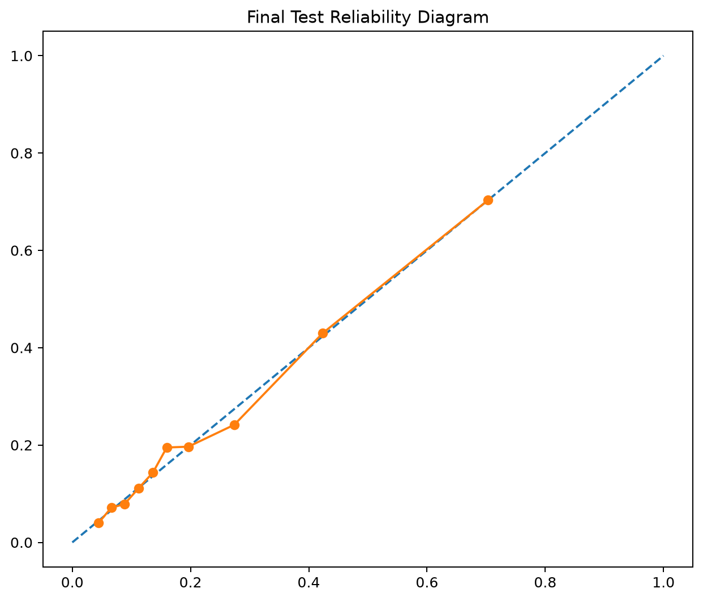
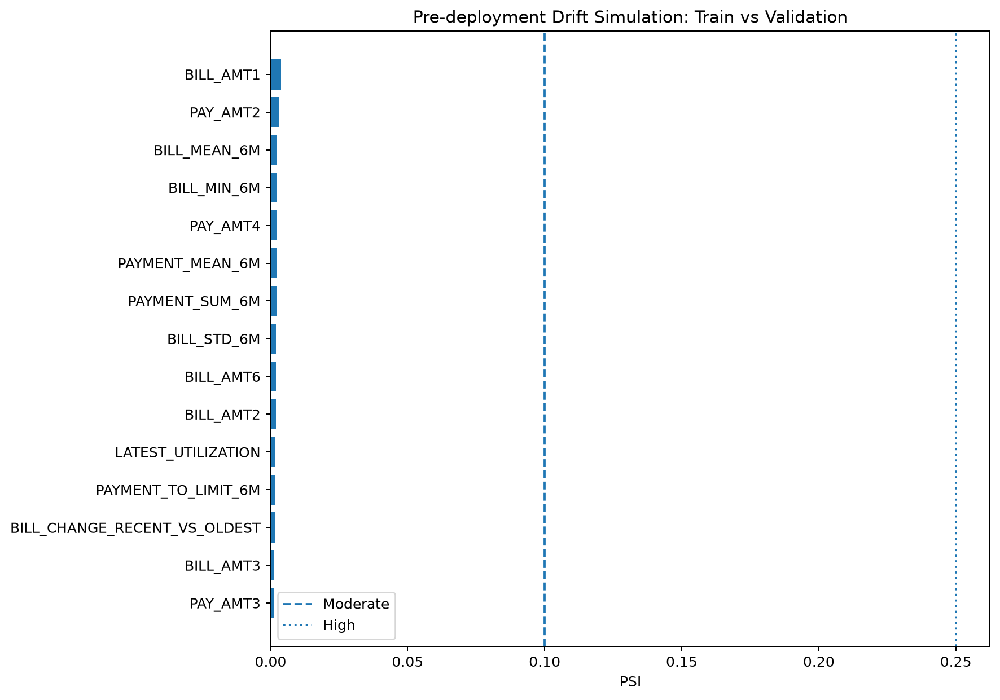

# 💳 Credit Risk Intelligence & Explainable Default Prediction

### End-to-End Machine Learning • Explainable AI • Decision Optimisation • Model Governance • MLOps

**A production-style credit-risk machine-learning case study spanning data validation, feature engineering, model benchmarking, hyperparameter optimisation, probability calibration, cost-sensitive decisioning, SHAP explainability, subgroup auditing, experiment tracking, API delivery, monitoring and CI.**

[🌐 Portfolio](https://tosinmulero.github.io/data-analytics-portfolio/) •
[💻 GitHub Profile](https://github.com/tosinmulero) •
[📊 Model Card](docs/MODEL_CARD.md) •
[🏗 Architecture](docs/ARCHITECTURE.md)

---

## 🚀 Executive Summary

Credit-risk modelling is not just a classification task. A decision-grade workflow must also address probability quality, operating thresholds, model explainability, subgroup behaviour, monitoring and reproducibility.

This project builds a complete machine-learning lifecycle on the **UCI Default of Credit Card Clients** benchmark dataset. It compares multiple model families, tunes XGBoost using Optuna, evaluates calibration, selects a cost-sensitive operating threshold, explains predictions with SHAP, audits subgroup performance, evaluates once on a sealed holdout set, tracks the final run with MLflow, exposes inference through FastAPI, provides a Streamlit interface, simulates drift monitoring and enforces automated quality checks with GitHub Actions.

> **Portfolio demonstration only.** This model is not intended for real lending, underwriting or adverse-action decisions.

---

## 🏆 Final Sealed-Test Performance

| Metric | Final Result | Interpretation |
|:---|---:|:---|
| **ROC-AUC** | **0.7834** | Ranking discrimination |
| **PR-AUC / Average Precision** | **0.5622** | Performance on the imbalanced positive class |
| **Recall** | **80.71%** | Most observed defaults detected at the selected threshold |
| **Precision** | **34.91%** | Trade-off created by recall-oriented decisioning |
| **F1 Score** | **0.4874** | Precision/recall balance |
| **Brier Score** | **0.1341** | Probability-quality measure |
| **Log Loss** | **0.4270** | Probabilistic prediction loss |
| **Expected Calibration Error** | **0.0133** | Observed calibration gap |
| **Frozen Threshold** | **0.145** | Selected before final holdout evaluation |
| **Final Test Size** | **6,000** | Sealed 20% holdout |

The final holdout was evaluated **once after the model family, probability variant and operating threshold were frozen**. No model-selection decision was changed after inspecting the test results.

---

## 💼 Business-Aware Threshold Optimisation

A conventional threshold of 0.50 produced higher precision but missed many positive default cases. To demonstrate cost-aware decisioning, the project uses an illustrative error-cost scenario:

~~~text
False Positive Cost = 1 unit
False Negative Cost = 5 units
~~~

| Policy | Threshold | Precision | Recall | Illustrative Cost Units |
|:---|---:|---:|---:|---:|
| Standard threshold | 0.500 | 67.99% | 36.02% | 4,470 |
| **Selected policy** | **0.145** | **35.50%** | **82.06%** | **3,169** |

### 📉 Illustrative cost reduction: **29.1%**

The lower threshold intentionally prioritises detection of potential defaults while accepting more false positives.

> The 5:1 cost ratio is an analytical scenario, not a claim about real bank economics, expected credit loss or financial savings.

---

## 🧠 Model Development Strategy

| Model | Validation ROC-AUC | Validation PR-AUC | Role |
|:---|---:|---:|:---|
| Logistic Regression | 0.7689 | 0.5266 | Interpretable baseline |
| Random Forest | 0.7794 | 0.5424 | Non-linear ensemble benchmark |
| LightGBM | 0.7787 | 0.5481 | Gradient-boosting benchmark |
| XGBoost | 0.7867 | 0.5547 | Best untuned benchmark |
| **Optuna-Tuned XGBoost** | **0.7889** | **0.5629** | **Selected model family** |

### 🔧 Hyperparameter Optimisation

The selected XGBoost model was tuned with **30 Optuna trials**, **5-fold stratified cross-validation**, and **Average Precision / PR-AUC** as the optimisation objective. The sealed test set remained untouched during training, tuning, calibration and threshold selection.

Best cross-validation PR-AUC: **0.5666**

---

## 🎯 Probability Calibration

The tuned XGBoost model was compared with uncalibrated, isotonic and sigmoid probability variants. The original tuned XGBoost probability output was retained because post-hoc calibration did not improve probability-quality metrics sufficiently to justify replacing it.

**Calibration was measured rather than automatically applied.**

---

## 🧩 End-to-End Architecture

~~~mermaid
graph TD
    A[UCI Credit Default Data] --> B[Schema Validation and Data Quality]
    B --> C[Semantic Feature Engineering]

    C --> D[Train Split]
    C --> E[Validation Split]
    C --> F[Sealed Test Split]

    D --> G[Logistic Regression]
    D --> H[Random Forest]
    D --> I[LightGBM]
    D --> J[XGBoost]

    G --> K[Model Benchmarking]
    H --> K
    I --> K
    J --> K

    K --> L[Optuna XGBoost Tuning]
    L --> M[Probability Calibration Assessment]
    M --> N[Cost Sensitive Threshold Optimisation]

    N --> O[SHAP Explainability]
    N --> P[Subgroup Audit]

    O --> Q[Frozen Model and Threshold]
    P --> Q
    Q --> R[Final Sealed Holdout Evaluation]

    R --> S[MLflow Tracking]
    R --> T[FastAPI Inference]
    R --> U[Streamlit Dashboard]
    R --> V[Drift Monitoring]
    R --> W[Pytest and GitHub Actions]
~~~

---

## ⚙️ Feature Engineering

| Feature Family | Examples |
|:---|:---|
| **Delinquency intensity** | DELINQUENT_MONTHS_6M, SEVERE_DELINQUENT_MONTHS_6M |
| **Delay severity** | MAX_DELAY_MONTHS_6M, MEAN_DELAY_MONTHS_6M, RECENT_DELAY_MONTHS |
| **Utilisation** | LATEST_UTILIZATION, MEAN_UTILIZATION_6M, MAX_UTILIZATION_6M |
| **Billing behaviour** | BILL_MEAN_6M, BILL_STD_6M, BILL_CHANGE_RECENT_VS_OLDEST |
| **Payment behaviour** | PAYMENT_MEAN_6M, PAYMENT_SUM_6M, ZERO_PAYMENT_MONTHS_6M |
| **Capacity indicators** | PAYMENT_TO_LIMIT_6M, ZERO_LIMIT_FLAG |

The primary model uses **40 candidate features** before one-hot transformation.

SEX and AGE are excluded from the primary prediction feature set and retained for audit analysis.

---

## 🔍 Explainable AI with SHAP

The selected XGBoost model is explained with **TreeSHAP** at both global and local levels.

| Rank | Risk Driver | Mean Absolute SHAP |
|---:|:---|---:|
| 1 | PAY_0 | 0.2991 |
| 2 | SEVERE_DELINQUENT_MONTHS_6M | 0.1884 |
| 3 | DELINQUENT_MONTHS_6M | 0.1420 |
| 4 | LATEST_UTILIZATION | 0.0667 |
| 5 | RECENT_DELAY_MONTHS | 0.0663 |
| 6 | LIMIT_BAL | 0.0642 |
| 7 | MAX_UTILIZATION_6M | 0.0633 |
| 8 | MEAN_DELAY_MONTHS_6M | 0.0630 |

### Global SHAP Importance

### SHAP Beeswarm

> SHAP describes **model behaviour**, not causality.

---

## ⚖️ Responsible AI & Subgroup Audit

| Group | N | ROC-AUC | PR-AUC | Recall | False Positive Rate |
|:---|---:|---:|---:|---:|---:|
| Female | 3,615 | 0.7939 | 0.5513 | 81.25% | 41.11% |
| Male | 2,385 | 0.7798 | 0.5792 | 83.03% | 44.38% |

Observed sex-group recall gap: **1.78 percentage points**

Observed sex-group false-positive-rate gap: **3.27 percentage points**

Age-band results show larger variation, but some subgroups are small. The 65+ validation group contains only **26 observations**, so its apparent performance should not be treated as a stable population estimate.

> This is a descriptive model audit. It does **not** establish legal, regulatory or algorithmic fairness.

---

## 📈 Final Holdout Evaluation

<table>
<tr>
<td width="50%" align="center">

### ROC Curve

</td>
<td width="50%" align="center">

### Precision–Recall Curve

</td>
</tr>
<tr>
<td width="50%" align="center">

### Confusion Matrix

</td>
<td width="50%" align="center">

### Reliability Diagram

</td>
</tr>
</table>

~~~text
True Positives:   1,071
False Negatives:    256
True Negatives:   2,676
False Positives:  1,997
~~~

The frozen operating policy prioritises **default detection** over headline accuracy.

---

## 📊 Dataset

**Dataset:** Default of Credit Card Clients  
**Source:** UCI Machine Learning Repository  
**DOI:** [10.24432/C55S3H](https://doi.org/10.24432/C55S3H)

| Attribute | Value |
|:---|---:|
| Observations | 30,000 |
| Original predictors | 23 |
| Default observations | 6,636 |
| Non-default observations | 23,364 |
| Default prevalence | 22.12% |
| Missing feature values | 0 |
| Train split | 18,000 |
| Validation split | 6,000 |
| Final test split | 6,000 |

---

## 🛠️ Data Science & MLOps Stack

---

## 🚀 Delivery Layer

### FastAPI

~~~powershell
uvicorn credit_risk.api.app:app --reload --port 8000
~~~

Endpoints:

~~~text
GET  /health
POST /predict
~~~

Interactive documentation:

~~~text
http://127.0.0.1:8000/docs
~~~

### Streamlit

~~~powershell
streamlit run src/credit_risk/dashboard/app.py
~~~

The dashboard surfaces customer inputs, estimated default probability, frozen threshold, risk flag, final KPIs and global SHAP drivers.

---

## 📉 Drift Monitoring

A pre-deployment **Population Stability Index (PSI)** simulation compares training and validation distributions.

~~~text
PSI < 0.10         → Low shift
0.10 ≤ PSI < 0.25  → Moderate shift
PSI ≥ 0.25         → High shift
~~~

Observed train-to-validation PSI values were low across the leading monitored features.

These are monitoring heuristics, not universal regulatory thresholds.

---

## 🧪 Reproducibility

### Setup

~~~powershell
git clone https://github.com/tosinmulero/credit-risk-explainable-ai.git
cd credit-risk-explainable-ai

python -m venv .venv
.\.venv\Scripts\Activate.ps1
python -m pip install --upgrade pip
pip install -r requirements.txt
pip install -e . --no-deps
~~~

### Pipeline

~~~powershell
python -m credit_risk.data.download_data
python -m credit_risk.data.validate_data
python -m credit_risk.features.build_features
python -m credit_risk.models.train
python -m credit_risk.models.compare_models
python -m credit_risk.models.tune_xgboost
python -m credit_risk.models.calibrate
python -m credit_risk.models.threshold
python -m credit_risk.models.explain
python -m credit_risk.models.fairness
~~~

The final holdout evaluation is intentionally separated from model selection and should not be used for tuning.

### Quality Gates

~~~powershell
python -m pytest -q
python -m ruff check src tests verify_project.py --ignore E501
~~~

---

## 🗂️ Repository Structure

~~~text
credit-risk-explainable-ai/
│
├── .github/workflows/ci.yml
├── config/project.yaml
├── data/
├── docs/
├── models/
├── reports/
│   ├── figures/
│   └── metrics/
├── src/credit_risk/
│   ├── analysis/
│   ├── api/
│   ├── dashboard/
│   ├── data/
│   ├── features/
│   ├── models/
│   ├── monitoring/
│   └── utils/
├── tests/
├── pyproject.toml
├── requirements.txt
├── requirements-lock.txt
├── verify_project.py
└── README.md
~~~

---

## ✅ Automated Quality Assurance

Every push to main triggers **Credit Risk CI**:

~~~text
✓ Python 3.12 environment
✓ Dependency installation
✓ Ruff static-analysis quality gate
✓ Pytest automated tests
~~~

---

## 🧭 Model Governance

| Governance Decision | Implementation |
|:---|:---|
| **Leakage prevention** | Train, validation and test responsibilities separated |
| **Sealed holdout** | Test untouched during selection |
| **Probability assessment** | Brier score, log loss and ECE evaluated |
| **Threshold governance** | Threshold selected on validation data only |
| **Explainability** | Global and local TreeSHAP analysis |
| **Sensitive attributes** | Sex and age excluded from primary model inputs and retained for audit |
| **Subgroup analysis** | Error rates and discrimination metrics compared |
| **Experiment tracking** | MLflow final-run metadata |
| **Monitoring** | PSI-based drift simulation |
| **Software quality** | Pytest, Ruff and GitHub Actions |
| **Repository hygiene** | Large model binaries excluded from Git history |

---

## 🎓 Skills Demonstrated

| Capability | Evidence |
|:---|:---|
| **Machine Learning** | Logistic Regression, Random Forest, LightGBM, XGBoost |
| **Model Selection** | Validation benchmarking |
| **Hyperparameter Tuning** | Optuna + stratified CV |
| **Imbalanced Classification** | PR-AUC-led optimisation |
| **Probability Modelling** | Calibration comparison, Brier, log loss, ECE |
| **Decision Science** | Cost-sensitive threshold optimisation |
| **Explainable AI** | SHAP global and local explanations |
| **Responsible AI** | Demographic subgroup audit |
| **MLOps** | MLflow tracking |
| **Model Serving** | FastAPI |
| **Application Development** | Streamlit |
| **Monitoring** | PSI drift framework |
| **Software Engineering** | Modular package, tests, linting and CI |
| **Model Governance** | Frozen selection policy and sealed holdout |

---

## ⚠️ Limitations

This project uses a public historical benchmark dataset rather than live lending data. It should **not** be used for real-world credit underwriting.

A production system would require representative current data, out-of-time validation, formal model-risk management, institution-specific loss assumptions, legal and regulatory review, security controls, robust fairness assessment, human oversight and live performance monitoring.

---

## 📚 Technical Documentation

| Document | Purpose |
|:---|:---|
| [MODEL_CARD.md](docs/MODEL_CARD.md) | Intended use, performance and limitations |
| [ARCHITECTURE.md](docs/ARCHITECTURE.md) | End-to-end system design |
| [DATA_SOURCE.md](docs/DATA_SOURCE.md) | Dataset provenance |
| [FEATURE_ENGINEERING.md](docs/FEATURE_ENGINEERING.md) | Feature design |
| [XGBOOST_OPTIMISATION.md](docs/XGBOOST_OPTIMISATION.md) | Hyperparameter search |
| [PROBABILITY_CALIBRATION.md](docs/PROBABILITY_CALIBRATION.md) | Calibration assessment |
| [THRESHOLD_OPTIMISATION.md](docs/THRESHOLD_OPTIMISATION.md) | Decision policy |
| [SHAP_EXPLAINABILITY.md](docs/SHAP_EXPLAINABILITY.md) | Explainability |
| [FAIRNESS_AUDIT.md](docs/FAIRNESS_AUDIT.md) | Subgroup audit |
| [FINAL_TEST_EVALUATION.md](docs/FINAL_TEST_EVALUATION.md) | Sealed holdout results |
| [DRIFT_MONITORING.md](docs/DRIFT_MONITORING.md) | Monitoring framework |

---

## 👤 Oluwatosin Mulero

### Data Analyst • Data Scientist • Business Intelligence

Building reproducible analytics and machine-learning systems that turn complex data into decision-ready insight.

**Built as an end-to-end Data Science portfolio case study with explicit model-governance controls.**

